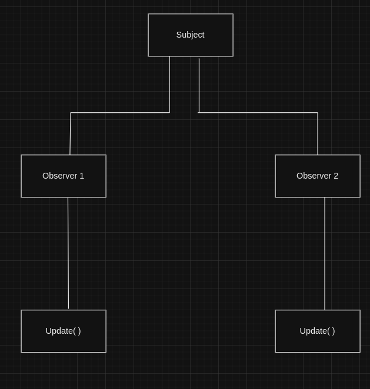
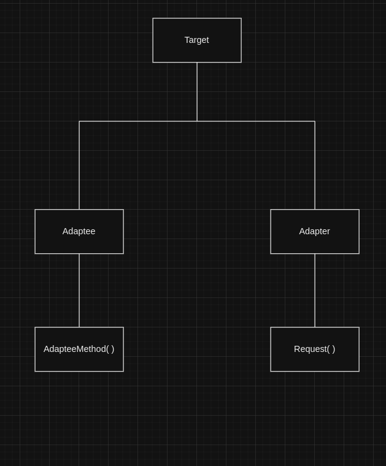

# Padroes_De_Projeto

Padrão Comportamental: Observer

Problema: Um objeto precisa notificar outros objetos sobre mudanças em seu estado.

Solução: O padrão Observador define uma dependência um-para-muitos entre objetos para que quando um objeto muda de estado, todos os seus dependentes sejam notificados e atualizados automaticamente.

Padrão Criacional: Factory Method

Problema: Uma classe precisa criar objetos de classes diferentes, mas o tipo de objeto a ser criado não é conhecido até o tempo de execução.

Solução: O padrão Factory Method fornece uma maneira de encapsular a criação de objetos em uma subclasse, permitindo que o tipo de objeto a ser criado seja determinado no tempo de execução.

Padrão Estrutural: Adapter

Problema: Dois objetos incompatíveis precisam trabalhar juntos, mas eles têm interfaces diferentes.

Solução: O padrão Adapter converte a interface de um objeto em uma interface esperada por outro objeto, permitindo que eles trabalhem juntos.

